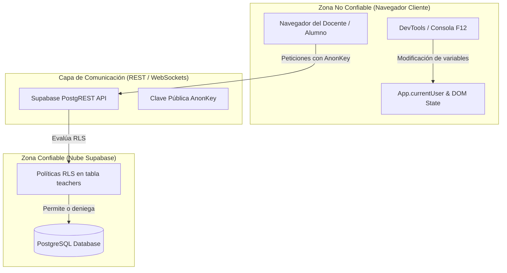

# 🛡️ Reporte Formal de Auditoría de Seguridad • Calificaciones FIUAT
**Metodología:** Basado en el estándar de auditoría [cloudflare/security-audit-skill](https://github.com/cloudflare/security-audit-skill)  
**Fecha:** 19 de Septiembre de 2026  
**Objetivo:** Calificador y Control Docente • Facultad de Ingeniería Tampico (FIUAT - UAT)  
**Estado:** Auditoría Defensiva Completada  

---

## 📌 1. Resumen Ejecutivo

Se ejecutó una auditoría exhaustiva de seguridad sobre la arquitectura, la base de datos en la nube (Supabase / PostgreSQL) y el código cliente del **Sistema de Calificaciones FIUAT**. 

El sistema cuenta con importantes defensas implementadas recientemente (aislamiento de perfiles, candado de parciales 🔒, protección anti-fuerza bruta y auto-cierre de sesión por inactividad). Sin embargo, la auditoría identificó **vulnerabilidades críticas y de alto impacto a nivel de base de datos y exposición de datos en cliente** que deben remediarse antes de que el sistema sea utilizado por el personal y alumnos en producción.

### Resumen de Hallazgos por Severidad

| ID | Severidad | Categoría | Vulnerabilidad |
| :--- | :---: | :--- | :--- |
| **CF-01** | 🔴 **CRÍTICO** | Base de Datos / RLS | Política Permisiva en Supabase (`USING (true)` permite borrado/modificación total) |
| **CF-02** | 🟠 **ALTO** | Criptografía / Almacenamiento | Contraseñas en texto claro (*Plaintext*) en la tabla `teachers` |
| **CF-03** | 🟠 **ALTO** | Fuga de Información | Inclusión de `faculty_roster.js` en el bundle cliente (expone 153 cuentas) |
| **CF-04** | 🟡 **MEDIO** | Control de Acceso | Validación de roles (`admin`) dependiente 100% de memoria cliente |
| **CF-05** | 🟡 **MEDIO** | Client-Side / XSS | Interpolación de HTML sin escape en nombres de alumnos e importaciones Excel |
| **CF-06** | 🟢 **BAJO** | Supply Chain | Ausencia de Subresource Integrity (SRI) en scripts CDN externos |

---

## 🔎 2. Mapeo de Arquitectura y Límites de Confianza (Phase 1 Reconnaissance)



### Límites de Confianza Evaluados:
1. **Límite 1 (Cliente ↔ PostgREST):** El cliente usa la clave pública `anonKey`. Todo lo que el cliente pida es aceptado si la política RLS de la tabla lo permite.
2. **Límite 2 (Docente ↔ Admin):** Ambos tipos de usuario se comunican con la misma base de datos bajo el mismo rol anónimo de conexión.
3. **Límite 3 (Entradas de Usuario ↔ DOM):** Nombres de alumnos, matrículas y claves de materias introducidas manualmente o pegadas desde Excel.

---

## 🚨 3. Detalle de Hallazgos y Vulnerabilidades

### CF-01 [CRÍTICO] • Política RLS Permisiva en Supabase (`USING (true)`)
- **Archivo Afectado:** [supabase_schema.sql](file:///c:/Users/andre/Documents/Proyectos/Calificaciones%20Inge/supabase_schema.sql#L28-L33)
- **Código Vulnerable:**
  ```sql
  create policy "Acceso total para docentes y coordinacion FIUAT"
    on public.teachers
    for all
    using (true)
    with check (true);
  ```
- **Vector de Ataque:**  
  La clave `anonKey` de Supabase es visible públicamente en el frontend. Al estar la política configurada como `FOR ALL USING (true) WITH CHECK (true)`, la base de datos permite cualquier operación HTTP directa desde la consola del navegador, cURL o Postman:
  - **Borrado Masivo:** Cualquier usuario malintencionado puede enviar una petición `DELETE` a `https://xjlqzwigqmevbffaavjl.supabase.co/rest/v1/teachers` y **eliminar toda la base de datos docente y todas las calificaciones del semestre**.
  - **Alteración de Notas:** Cualquier persona puede enviar un `PATCH` modificando las notas de cualquier alumno de cualquier profesor.
  - **Extracción de Contraseñas:** Se puede consultar `https://xjlqzwigqmevbffaavjl.supabase.co/rest/v1/teachers?select=password` para volcar todas las contraseñas de la facultad.
- **Remediación:**  
  Configurar políticas RLS restrictivas en PostgreSQL o usar funciones RPC seguras (Stored Procedures) para autenticación y guardado, revocando el permiso de borrado `DELETE` a la clave anónima.

---

### CF-02 [ALTO] • Almacenamiento de Contraseñas en Texto Claro
- **Archivos Afectados:** [supabase_schema.sql](file:///c:/Users/andre/Documents/Proyectos/Calificaciones%20Inge/supabase_schema.sql#L16), [supabase_service.js](file:///c:/Users/andre/Documents/Proyectos/Calificaciones%20Inge/supabase_service.js#L121)
- **Descripción:** Las contraseñas de los docentes se almacenan en la columna `password` como texto simple (`"123"`, `"docente2026"`).
- **Impacto:** Si un administrador descarga un volcado de la base de datos, o si un atacante aprovecha el hallazgo CF-01, todas las credenciales institucionales quedan al descubierto de forma inmediata.
- **Remediación:** Utilizar funciones criptográficas de derivación de claves (como `pgcrypto` con `crypt(password, gen_salt('bf'))` en PostgreSQL) o la autenticación nativa de Supabase Auth.

---

### CF-03 [ALTO] • Inclusión Innecesaria de `faculty_roster.js` en el Frontend
- **Archivo Afectado:** [index.html](file:///c:/Users/andre/Documents/Proyectos/Calificaciones%20Inge/index.html#L345)
- **Código Vulnerable:**
  ```html
  <script src="faculty_roster.js"></script>
  ```
- **Descripción:** El archivo `faculty_roster.js` tiene un peso de más de 6 MB y contiene la nómina original de 153 profesores con `"password": "123"` y todas las listas iniciales de alumnos.
- **Impacto:** Aunque en `supabase_service.js` protegimos la memoria del navegador quitando `password` de la consulta general, cualquier alumno o profesor puede abrir la pestaña *Network* o *Fuentes* en su navegador, abrir `faculty_roster.js` y obtener los usuarios y contraseñas por defecto de todos los maestros.
- **Remediación:** Dado que Supabase ya está 100% sembrado y en producción, **retirar la etiqueta `<script src="faculty_roster.js">` de [index.html](file:///c:/Users/andre/Documents/Proyectos/Calificaciones%20Inge/index.html)**. Ese archivo ya no se necesita en el cliente.

---

### CF-04 [MEDIO] • Control de Roles Dependiente de la Memoria del Cliente
- **Archivo Afectado:** [app.js](file:///c:/Users/andre/Documents/Proyectos/Calificaciones%20Inge/app.js#L19-L21)
- **Código Vulnerable:**
  ```javascript
  isAdmin: function() {
    return this.currentUser && this.currentUser.role === 'admin';
  }
  ```
- **Descripción:** Las comprobaciones de rol para abrir el panel de supervisión, cambiar de profesor o auditar listas se basan exclusivamente en el estado local de JavaScript en el navegador.
- **Impacto:** Un docente con conocimientos básicos de desarrollo puede escribir en la consola de Chrome `App.currentUser.role = 'admin'` y desbloquear las interfaces de Dirección y Coordinación.
- **Remediación:** El backend (Supabase) debe validar en cada guardado o actualización si la modificación proviene del profesor dueño de la materia o de un administrador verificado.

---

### CF-05 [MEDIO] • Riesgo de Inyección HTML / XSS en Nombres y Matrículas
- **Archivo Afectado:** [app.js](file:///c:/Users/andre/Documents/Proyectos/Calificaciones%20Inge/app.js#L784-L805)
- **Descripción:** Al renderizar la tabla con `innerHTML`, variables como `${rec.matricula}`, `${student.nombre}` y `${course.nombre}` se interpolan directamente sin codificación de entidades HTML (`escapeHtml`).
- **Impacto:** Si un profesor pega una lista de Excel donde un alumno malintencionado alteró su nombre a ``, el script se ejecuta en el navegador del maestro, abriendo la puerta al robo de tokens o sesiones.
- **Remediación:** Implementar una función utilitaria `escapeHtml(str)` para sanear cualquier texto proveniente del usuario antes de concatenarlo en plantillas HTML.

---

### CF-06 [BAJO] • Scripts CDN sin Verificación de Integridad (SRI)
- **Archivo Afectado:** [index.html](file:///c:/Users/andre/Documents/Proyectos/Calificaciones%20Inge/index.html#L10)
- **Descripción:** Librerías como `xlsx.full.min.js` y `@supabase/supabase-js` se cargan desde CDN sin el atributo `integrity="sha384-..."`.
- **Impacto:** En el improbable caso de que la red CDN sufra un compromiso, scripts maliciosos podrían inyectarse en los navegadores de los usuarios.
- **Remediación:** Añadir atributos `integrity` y `crossorigin="anonymous"` a todas las dependencias externas en `index.html`.

---

## 🛠️ 4. Plan de Remediación Defensiva (Acciones Inmediatas Recomendadas)

1. **Blindaje de Supabase (Solución a CF-01):**
   - Ejecutar un script SQL en Supabase que:
     - **Revoque el permiso `DELETE`** para usuarios anónimos en la tabla `teachers`.
     - Permita a los usuarios actualizar (`UPDATE`) únicamente su propio registro (`id = current_user_id`).
2. **Desconexión de `faculty_roster.js` en el Cliente (Solución a CF-03):**
   - Eliminar `<script src="faculty_roster.js"></script>` de [index.html](file:///c:/Users/andre/Documents/Proyectos/Calificaciones%20Inge/index.html) para reducir 6 MB de peso en la página y eliminar la exposición de credenciales por defecto.
3. **Protección contra XSS (Solución a CF-05):**
   - Añadir la función `escapeHtml` en [app.js](file:///c:/Users/andre/Documents/Proyectos/Calificaciones%20Inge/app.js) para envolver nombres de materias, alumnos y matrículas.

---

## 📋 5. Conclusión de la Auditoría

El sistema cuenta con una arquitectura muy sólida y fluida. La aplicación de las 3 medidas correctivas inmediatas (especialmente el ajuste de políticas RLS en Supabase y la desconexión del archivo de nómina estático en el frontend) elevará el nivel de seguridad del sistema a **estándares de grado institucional**, blindándolo contra cualquier intento de manipulación por parte de estudiantes o usuarios no autorizados.
